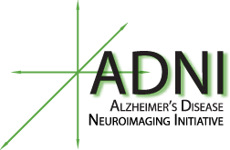
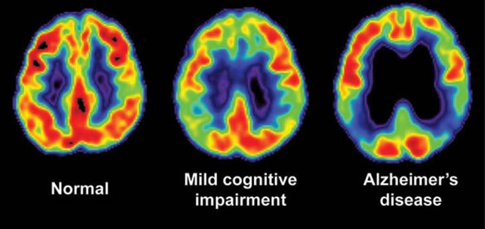
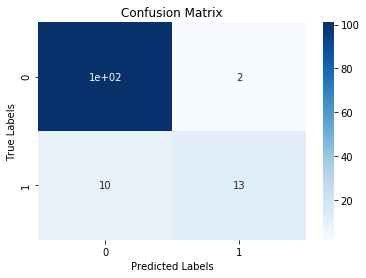
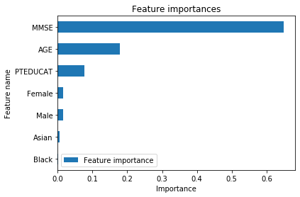

# Alzheimer's Diagnosis
Data Science Project by Grant Gasser under advisement of [Dr. Joshua Patrick](https://statistics.artsandsciences.baylor.edu/person/dr-joshua-d-patrick "Joshua Patrick") at Baylor University.



# Table of Contents
1. [Summary of Alzheimer's](https://github.com/grantgasser/Alzheimers-Prediction#summary-of-alzheimers-disease)
2. [Project Motivation](https://github.com/grantgasser/Alzheimers-Prediction#project-motivation)
3. [Data Set](https://github.com/grantgasser/Alzheimers-Prediction#first-data-set-adni-q3)
4. [Prediction Models, Data Set](https://github.com/grantgasser/Alzheimers-Prediction#prediction-models)


## Summary of Alzheimer's Disease



Alzheimer's disease (AD) is a progressive neurodegenerative disease. Though best known for its role in declining memory function, symptoms also include: difficulty thinking and reasoning, making judgements and decisions, and planning and performing familiar tasks. It may also cause alterations in personality and behavior. The cause of AD is not well understood. There is thought to be a significant hereditary component. For example, a variation of the APOE gene, APOE e4, increases risk of Alzheimer's disease. Pathologically, AD is associated with [amyloid beta plaques](https://www.google.com/search?amyloid+plaques) and [neurofibrillary tangles](https://www.google.com/search?neurofibrillary+tangles).

### Diagnosis
Onset of the disease is slow and early symptoms are often dismissed as normal signs of aging. A diagnosis is typically given based on history of illness, cognitive tests, medical imaging, and blood tests.

### Treatment
There is no medication that stops or reverses the progression of AD. There are two types of drugs that attempt to treat the cognitive symptoms:
* Acetylcholinesterase Inhibitors that work to prevent the breakdown of acetylcholine, a neurotransmitter critical in memory and cognition. 
* Memantine (Namenda), which works to inhibit NMDA receptors in the brain.

These medications can slightly slow down the progression of the disease.

### Prevention
It is thought that frequent mental and physical exercise may reduce risk.

---

## Project Motivation
The Alzheimer's Association estimates nearly 6 million Americans suffer from the disease and it is the 6th leading cause of death in the US. The estimated cost of AD was $277 billion in the US in 2018. The association estimates that *early and accurate* diagnoses could save up to $7.9 trillion in medical and care costs over the next few decades. 

Sources: [Mayo Clinic](https://www.mayoclinic.org/diseases-conditions/alzheimers-disease/symptoms-causes/syc-20350447 "Mayo Clinic - Alzheimer's Disease"), [Alzheimer's Association](https://www.alz.org/alzheimers-dementia/facts-figures), [Wikipedia](https://en.wikipedia.org/wiki/Alzheimer's_disease)


### Project Description: 
Using data provided by the [ADNI Project](http://adni.loni.usc.edu/), it is our goal to develop a computer model that assists in the diagnosis of the disease. We will try multiple models recently popularized in machine learning (Neural Network, SVM, etc.) and more traditional statistical models such as ordinal regression, multinomial regression, and decision trees. 

---
## Data Set: ADNI Q3
* 628 observations, 15 features (will likely use subset of features)
* Labels: (CN, LMCI, AD)
* Class Label distribution:

* Features include age, gender, years of education, race, genotype, cognitive test score (MMSE), and more

To simplify the problem, we collapse CN and LMCI into the same category of "Not AD" (aka "Not Alzheimer's").

**Important Note:** The models using this data set assume the physician diagnoses (the labels) are correct.

---
## Predictive Models

### Solution v3 (2023): Binary Classification with XGBoost
* File: [Refactored Approach](Refactored_Approach_2023.ipynb)
* `GradientBoostingClassifier`

**Results:**
```
Test Accuracy: 90.48%
Precision: 0.67
Recall: 0.87
F1: 0.75
AUC: 0.89
```

**Initial confusion matrix** (_before lowering threshold 0.5 -> 0.1 to increase Recall_):



**Feature Importances:** (from prior models):
    

Unsurpisingly, cognitive test scores (`MMSE`) and age (`AGE`) are the most predictive of Alzheimer's.

### Solution v2 (2021): Multi-Class Prediction in Python (Jupyter Notebook)
* File: [Multi-Class Classification Jupyter Notebook](https://github.com/grantgasser/Alzheimers-Prediction/blob/master/Multi-Class%20Classification%20ADNI.ipynb)
* Since the data was processed with Scikit-Learn, it was easy to try several models using the library such as logistic regression, random forest, k-nearest-neighbor, and multi-layer perceptron.

* 5-Fold Cross Validation: logistic regression had the highest validation score of `.69`

**Results:** 74% Test Accuracy

### Solution v1 (2019): Ordinal Regression (Ranking Learning) in R (CN < LMCI < AD)
* File: [ordinal.R](https://github.com/grantgasser/Alzheimers-Prediction/blob/master/ordinal.R)
* Features/Predictor Variables Used: AGE (Age at baseline), PTGENDER (Sex), PTEDUCAT (Years of Education), PTRACCAT (Race), APOE4 (APOE4) genotype, MMSE (MMSE score), Imputed_genotype (Challenge specific designation, TRUE=has imputed genotypes)

**Results:** 70% Test Accuracy (110/157)
* Main problem with the model is False Negatives. As pointed out at the end of the script, when the model makes incorrect predictions, it often predicts Cognitively Normal (CN) when a patient has Limited Mild Conitive Impairment (LMCI) or Alzheimer's (AD). Roughly 50% of the errors were False Negatives.
* This leads to a model with low sensitivity.

**Proposed Solution:** Only predict CN if P(CN) > *some threshold* instead of predicting max(P(CN), P(LMCI), P(AD)). This should reduce the amount of CN predictions and thus, reduce the amount of False Negatives.  
